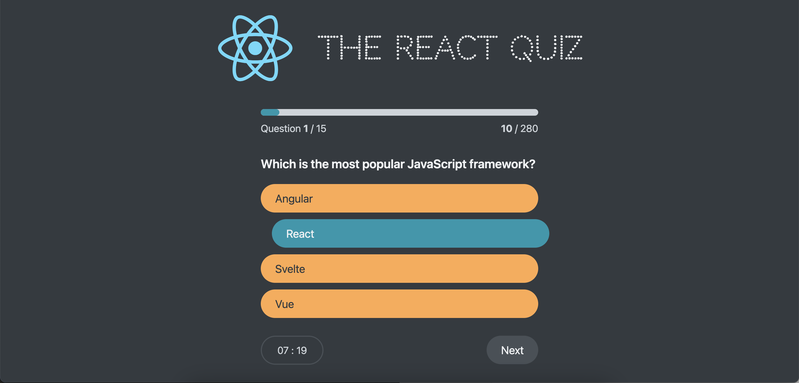

# Small react quiz app

## How to run

1. Clone the repository
2. Run `npm install`
3. Run `npm run server`
4. Run `npm start`

> This project was done as a part of [React Course](https://www.udemy.com/course/the-ultimate-react-course/)
