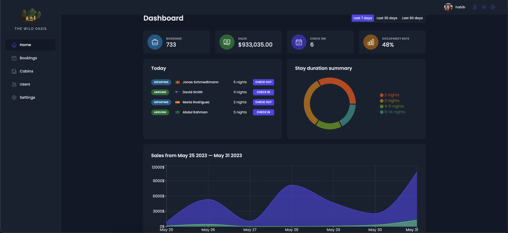

# 🏕️ Real World Cabin Booking App – The Wild Oasis

**The Wild Oasis** is a real-world inspired cabin booking system designed for internal staff use.  
Staff can manage cabins, handle reservations, view check-ins/outs, and monitor key metrics via a modern dashboard.

🌐 Live Demo: https://the-wild-oasis.vercel.app/

---

## 📸 Screenshot



---

## 🛠️ Getting Started

1. **Clone** the repository
2. **Install** dependencies:
   ```bash
   npm install
   ```
3. **Start** the development server:
   ```bash
   npm run dev
   ```

---

## ✨ Features

- Full **CRUD** for cabins, bookings, and users
- Admin/staff dashboard with analytics and charts
- Check-in / check-out workflows
- Dark-themed, responsive UI
- Built with **React**, **React Query**, and **Styled Components**

---

> 🧪 Project built as part of the [Ultimate React Course](https://www.udemy.com/course/the-ultimate-react-course/)
