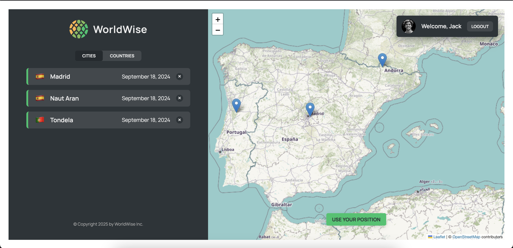

# 🌍 WorldWise

**WorldWise** is a simple web app for saving and organizing your travel experiences across the globe.

---

## 🖼️ Screenshot



---

## 🛠️ Getting Started

To run the project locally:

1. **Clone** the repository
2. **Install** dependencies:
   ```bash
   npm install
   ```
3. **Start** the JSON server:
   ```bash
   npm run server
   ```
4. **Launch** the development server:
   ```bash
   npm run dev
   ```

---

## 🚀 Features

- Add, view, and delete visited cities
- Interactive world map using Leaflet
- Local data persistence

> ✨ Built as part of the [Ultimate React Course](https://www.udemy.com/course/the-ultimate-react-course/)
